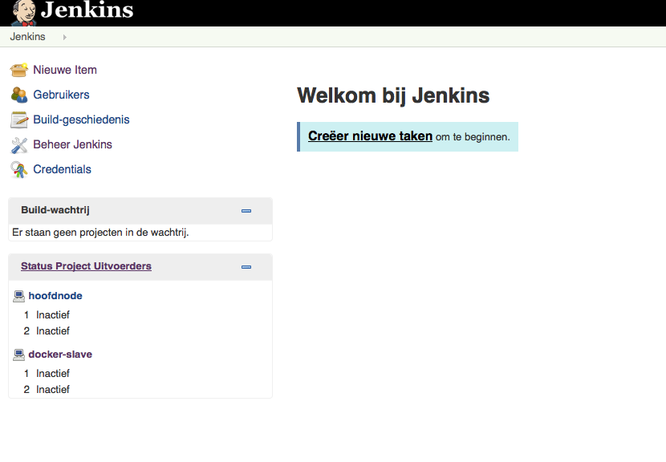

# Setting up a Jenkins instance (optional)

This exercise is optional if you have the VMs of the Jenkins master and the Jenkins slave, just run those VMs.
Otherwise follow the steps of this exercise to download and create and start the Jenkins master and slave VMs. (First
run takes a while for both VMs).

## Steps

The following steps

- Clone the Jenkins master vagrant instance [GIT repository](https://github.com/Hylke1982/jenkins-instance)
- Follow the instructions on the Jenkins instance [Instructions](https://github.com/Hylke1982/jenkins-instance/blob/master/README.md)
- Clone the Jenkins slave vagrant instance [GIT repository](https://github.com/Hylke1982/jenkins-slave-docker-instance.git)
- Follow the instructions on the Jenkins instance  [GIT repository](https://github.com/Hylke1982/jenkins-slave-docker-instance/blob/master/README.md) [TODO README]

## Check if the Jenkins instance is running

After following the start instructions check if the Jenkins instance is running. In your browser open the following URL.
[http://33.33.33.30:8080](http://33.33.33.30:8080) If the Jenkins master and slave are running correctly you will see
this Jenkins master web interface.

