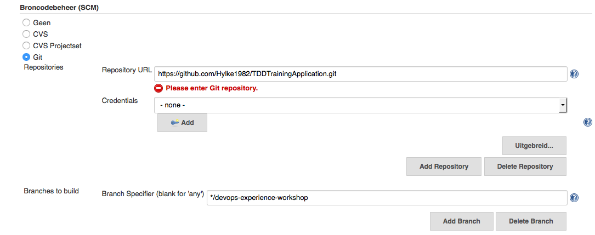

# Setting up the seed job

The seed job enables you to read your continuous development pipeline configuration from your source code, and always
use the latest version of the pipeline. (This is the part of the workshop that isn't versioned)

## Prequisites

The following components are nescessary to do this exercise:

- Running Jenkins instance with the correct plugins installed

## Steps to create the seed job

- Create a free-style job with the 'seed-job'

- Configure the Git repository within the 'seed-job', the git URL should be 'git://github.com/[github account]/TDDTrainingApplication' and the branch should be configured to 'devops'.

- Also configure the JOB DSL build by adding a new build step and configure build step to use jobs from the filesystem. The jobs can be looked up on the location 'pipeline/**/*.groovy" (all groovy files in the pipeline directory can be considered as job configuration)

