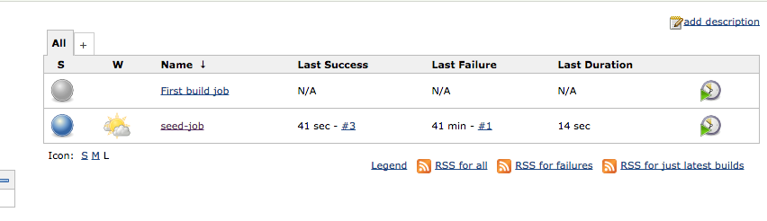

# Creating a simple build job

In this exercise a simple build job is created, and the job will be started from Jenkins.

## Steps to create the first build job

- Goto the directory where the TDDTrainingApplication is checked out, and also if the current branch is 'devops'
```
# To view current branch
git status
```
- Create a directory with the name 'pipeline'
```
mkdir pipeline
```
- Add a file with the name 'job-101.groovy' in the 'pipeline' directory and paste the following content in the file.
```groovy
// Replace 'Hylke1982' within the URL with your own GitHub account
job {
    name 'First build job'
    scm {
        git('https://github.com/Hylke1982/TDDTrainingApplication', 'devops')
    }
    steps {
        maven('clean package')
    }
}
```
- Add, commit and push the changes to GitHub
```
# Add
git add .
git commit -m "Some message"
git push origin devops
```
- Rerun the seed-job within Jenkins to automaticly configure the build pipeline within Jenkins.
- Check if the 'First build job' is created within Jenkins

