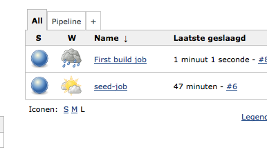
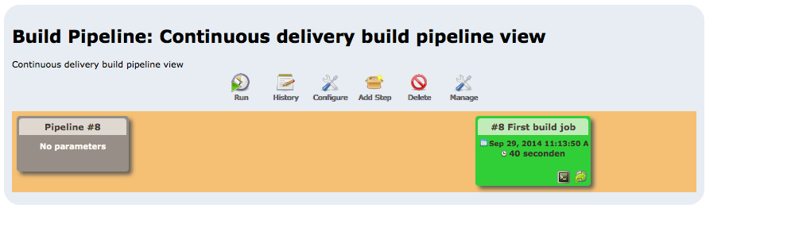

# Create a pipeline view

In this exercise a pipeline will be created within the Jenkins installation.

## Prerequisites

The following components need to be installed:

- Pipeline view plugin (is already installed within the Jenkins instance)

## Steps to configure a build pipeline

- Within the TDDTrainingApplication create the 'pipeline.groovy' file within the 'pipeline' directory.
- Insert the following content in the 'pipeline.groovy' file
```groovy
view(type: BuildPipelineView) {
    name('Pipeline')
    description('Continuous delivery build pipeline view')
    filterBuildQueue()
    filterExecutors()
    title('Continuous delivery build pipeline view')
    selectedJob('First build job (compilation)')
    alwaysAllowManualTrigger()
    showPipelineParameters()
    refreshFrequency(60)
}
```

- Commit and push the changes to GitHub
```# Add
git add .
git commit -m "Some message"
git push origin devops-experience-workshop```

- The pipeline will be installed after building the 'seed-job':
- Go to the seed job and click the build now button
- Go to the dashboard and the new pipeline view is added to the jenkins dashboard


- You can start the execution of the pipeline by clicking run on the pipeline dashboard

