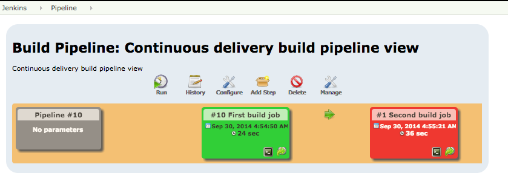

# Adding a second build job

In this exercises a second build job is added, this job is triggered after the first job has run successful.

## Steps to create a second build job

The following steps create the second build job:

- Edit the the 'pipeline/job-101.groovy' file add a publisher configuration in the job definition.
```groovy
publishers {
 downstream('Second build job')
}
```
- Create a new file 'job-102.groovy' to the directory 'pipeline' and insert the following job definition in the file.
```groovy
// Replace 'Hylke1982' within the URL with your own GitHub account
job {
    name 'Second build job'
    scm {
        git('https://github.com/Hylke1982/TDDTrainingApplication', 'devops')
    }
    steps {
        maven('test')
    }
}
```
- Add, commit and push the changes to the Git repositories.
- After running the 'seed-job' again the 'Second build job' is now available.
- A extra step is added to the continuous delivery pipeline

